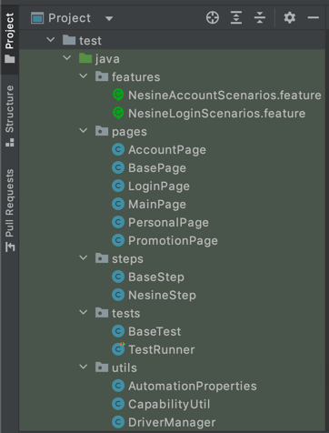

# Mobile Bdd Test Automation Framework
Java Appium Automation Test With Gherkin Syntax

# Test Approach
The tests were created for mobile automation testing, on every test run some checks and validation are done with certain and random inputs to verify that data is displayed, clicked and edited correctly. Also tests are supported negative validation (Negative Tests).


# Project Solution

Features folder contains our tests. Encoded with the Gherkin syntax. Background steps work before the test and ensure that the test becomes executable.

Utils directory allows the driver to be created and passed other classes.
Also it contains capabilityUtil to read from prop file and access testng props.
CustomLogger class created for extended logging. It can be detailed later depends on our requirement.

Test directory is contains TestRunner and BaseTest. TestNG.xml runs test runner.

The steps directory contains the descriptions of the steps written in the features files.
BaseSteps class is used for create PageObject and pass driver to these classes.

The PageObject directory contains the objects in the pages and the methods that will operate on these objects.

Testng.xml file contins parallelize option with device parameter to run our tests.


This type of solution was used for better code reusability, maintainability of mobile automation testing framework.


# Framework / Libraries / Tech Stack

        Jdk 1.8
        Jre 1.8
        Appium 7.5
        Selenium-java 3.141
        Testng 7.4.0
        Allure 2.20.0


This project was developed using Java V1.8 with TestNg, Maven, Cucumber and Appium as a mobile test automation framework.


# Scenarios covered on the solution

**The following scenarios are cover by the automation test suite:**

* **Verify valid users can logIn / logOut(NesineLoginScenarios.feature).**

* **(Negative) Verify invalid users can/'t logIn / (NesineLoginScenarios.feature).**

* **Verify loading promotion code (NesineAccountScenarios.feature).**

* **Verify userId which is seen on main screen with personal info screen's userId (NesineAccountScenarios.feature).**


# Framework Installation & Prerequisites

Foobar is a Python library for dealing with word pluralization.

## Prerequities
```bash
#Maven binaries should be previously downloaded.
$ tar -xvf apache-maven-3.6.3-bin.tar.gz

$ export M2_HOME="/Users/{yourUser}/Downloads/apache-maven-3.6.3"
$ PATH="${M2_HOME}/bin:${PATH}"
$ export PATH
$ mvn -version     

OpenJDK 64-Bit Server VM warning: Ignoring option MaxPermSize; support was removed in 8.0
Apache Maven 3.6.3 (cecedd343002696d0abb50b32b541b8a6ba2883f)
Maven home: /Users/pankaj/Downloads/apache-maven-3.6.3
```

```bash
Appium Server should be installed.
Dmg package can be downloadable from own site.

```

```bash
#npm also should be installed for allure installation on your macOS 10.14 Majove
$ npm install -g allure-commandline --save-dev

# 'Allure serve' command can be usable directly

```

## Installation

```bash
Open project with IntellijIdea (Optional).
'Open ides terminal to install repositories in pom.xml via mvn'
#$ mvn dependency:resolve
or
'Maven plugin in your ide can resolve dependencies automaticly'


'Turn appium server on then connect real devices and AndroidSdk Virtual Devices'
```

## Usage

Start test after connection via mvn command
```java

mvn clean test //direclty run test succesfully

//If you want to pass parameter from cmd,
//Properties should be defined in pom.xml
//Then we can call from test runnig
        mvn clean test -Dapp.username=akkaya040 -Dapp.password=*******


```
